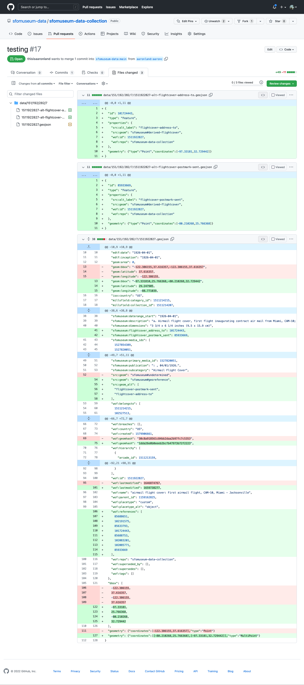

# go-writer-github

GitHub API support for the [go-writer](https://github.com/whosonfirst/go-writer) `Writer` interface.

This package supersedes the [go-whosonfirst-readwrite-github](https://github.com/whosonfirst/go-whosonfirst-readwrite-github) package.

## Documentation

Documentation is incomplete.

## Example

```
package main

import (
	"context"
	"flag"
	"fmt"	
	"github.com/whosonfirst/go-writer"
	_ "github.com/whosonfirst/go-writer-github"		
	"io/ioutil"
	"strings"
	"time"
)

func main() {

	owner := "example"
	repo := "example-repo"
	access_token := "s33kret"
	branch := "example"

	ctx := context.Background()
	
	source := fmt.Sprintf("githubapi://%s/%s?access_token=%s&branch=%s", owner, repo, access_token, branch)
			
	wr, _ := writer.NewWriter(ctx, source)

	now := time.Now()
	msg := fmt.Sprintf("This is a test: %v", now)
	
	br := strings.NewReader(msg)
	fh := ioutil.NopCloser(br)

	wr.Write(ctx, "TEST.md", fh)
}
```

_Error handling has been omitted for brevity._

## URIs

### githubapi

The `githubapi` scheme is used to publish individual documents to a Git repository using the GitHub API.

The URI structure for `go-writer-github` (API) writers is:

| Component | Value | Notes |
| --- | --- | --- |
| Scheme | `githubapi` | |
| Host | string | A valid GitHub owner or organization |
| Path | string | A valid GitHub respository |
| Query | | _described below_ |

The following query parameters are supported for `go-writer-github` writers:

| Name | Value | Required | Notes |
| --- | --- | --- | --- |
| access_token | string | yes | A valid GitHub API access token |
| branch | string | no | A valid Git repository branch. Default is `main`. |
| prefix | string | no | An optional path to prepend URIs (for writing) with. |
| new | string | no | A valid string for formatting new file commit messages. Default is `Created %s`. |
| update | string | no | A valid string for formatting updated file commit messages. Default is `Updated %s`. |
| retry-on-ratelimit | boolean (string) | no | If true and the writer encounters a GitHub rate-limit error trying to write data it will sleep until the "reset" time (published by GitHub) and retry the write operation. |
| retry-on-conflict | boolean (string) | no | If true and the writer encounters a GitHub `409 Conflict` error trying to write data it will keep trying (by refreshing the current hash) until it succeeds, with the limits of the `?max-retry-attempts` flag. | 
| max-retry-attempts | int | no | Default is 10. If <=0 then checks on the maximum number of retry attempts will be disabled. |

For example:

```
githubapi://whosonfirst-data/whosonfirst-data-admin-us \
	?access_token={access_token} \
	&branch=main
```

### githubapi-pr

The `githubapi-pr` scheme is used to write documents to a GitHub pull request using the GitHub API. The pull request is created when the writer's `Close()` method is called.

_Note: At this time all documents passed to the writer's `Write()` method are stored in memory so until a mechanism for buffering writes to disk (or equivalent) is implemented then you may need to monitor memory consumption if you are using this will a lot of documents._

The URI structure for `go-writer-github` (API Pull Request) writers is:

| Component | Value | Notes |
| --- | --- | --- |
| Scheme | `githubapi-pr` | |
| Host | string | A valid GitHub owner or organization |
| Path | string | A valid GitHub respository |
| Query | | _described below_ |

The following query parameters are supported for `go-writer-github` writers:

| Name | Value | Required | Notes |
| --- | --- | --- | --- |
| access_token | string | yes | A valid GitHub API access token |
| branch | string | no | A valid Git repository branch. Default is `main`. |
| prefix | string | no | An optional path to prepend URIs (for writing) with. |
| pr-owner | string | no | The user or organization name where the pull request will be created. If empty will default to GitHub owner or organization defined in URI host field. |
| pr-repo | string | no | The repository name where the pull request will be created. If empty will default to GitHub owner or organization defined in URI path field. |
| pr-branch | string | yes | The name of branch that the pull request will be created for. |
| pr-title | string | yes | The title of the pull request being created. |
| pr-description | string | yes | The description of the pull request being created. |
| pr-author | string | no | The author of the pull request being created. If empty the name associated with the GitHub access token will be used (must not be empty). |
| pr-email | string | no | The email address associated with the pull request being created. If empty the email address associated with the GitHub access token will be used (must not be empty). |
| pr-ensure-repo | bool | no | If true then the existence of {pr_owner}/{pr_repo} will be checked. If it does not exist then it will be forked (and if necessary renamed) from the organization and repo defined in the URI Host and Path fields. |

For example:

```
githubapi-pr://sfomuseum-data/sfomuseum-data-collection \
	?access_token={access_token} \
	&branch=main \
	&prefix=data/ \
	&pr-branch=aaronc \
	&pr-title=testing \
	&pr-description=testing \
	&pr-email=aaron@localhost \
	&pr-repo=sfomuseum-data-testing \
	&pr-owner=aaronland \
	&ensure-repo=true
```

Which might yield something like this:



### githubapi-tree

The `githubapi-tree` scheme is used to write multiple documents to a GitHub tree commit using the GitHub API. The pull request is created when the writer's `Close()` method is called.

_Note: At this time all documents passed to the writer's `Write()` method are stored in memory so until a mechanism for buffering writes to disk (or equivalent) is implemented then you may need to monitor memory consumption if you are using this will a lot of documents._

The URI structure for `go-writer-github` (API Pull Request) writers is:

| Component | Value | Notes |
| --- | --- | --- |
| Scheme | `githubapi-tree` | |
| Host | string | A valid GitHub owner or organization |
| Path | string | A valid GitHub respository |
| Query | | _described below_ |

The following query parameters are supported for `go-writer-github` writers:

| Name | Value | Required | Notes |
| --- | --- | --- | --- |
| access_token | string | yes | A valid GitHub API access token |
| branch | string | no | A valid Git repository branch. Default is `main`. |
| prefix | string | no | An optional path to prepend URIs (for writing) with. |
| to-branch | string | yes | The name of branch that the pull request will be created for. |
| description | string | yes | The description of the pull request being created. |
| author | string | no | The author of the pull request being created. If empty the name associated with the GitHub access token will be used (must not be empty). |
| email | string | no | The email address associated with the pull request being created. If empty the email address associated with the GitHub access token will be used (must not be empty). |

For example:

```
githubapi-tree://sfomuseum-data/sfomuseum-data-collection \
	?access_token={access_token} \
	&branch=main \
	&prefix=data/ \
	&description=testing \
	&email=aaron@localhost 
```

## See also

* https://github.com/whosonfirst/go-writer
* https://github.com/google/go-github
* https://developer.github.com/v3/#authentication
